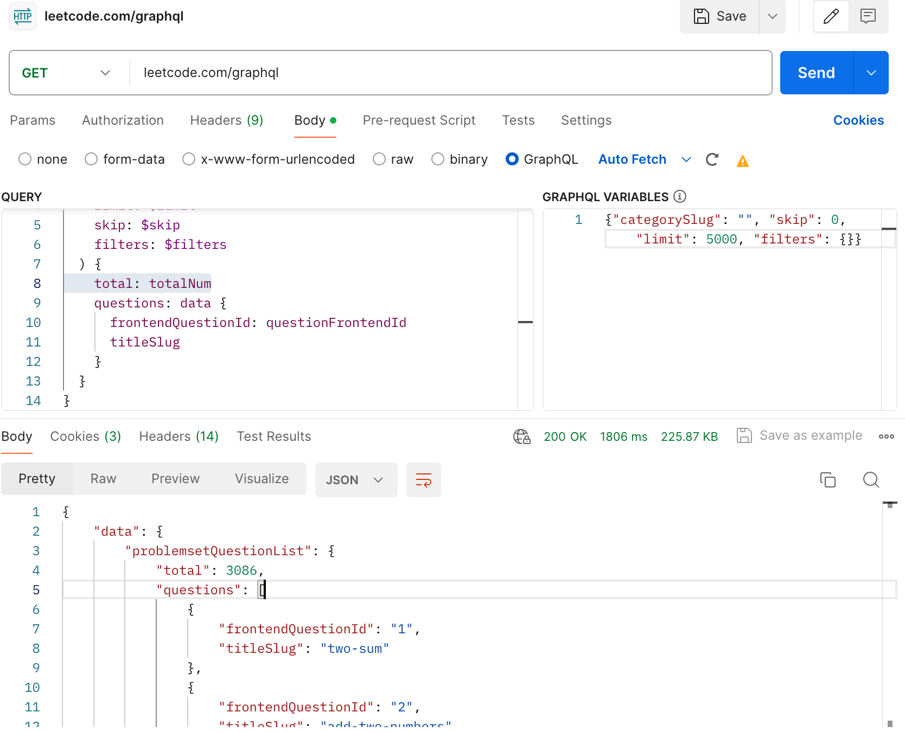
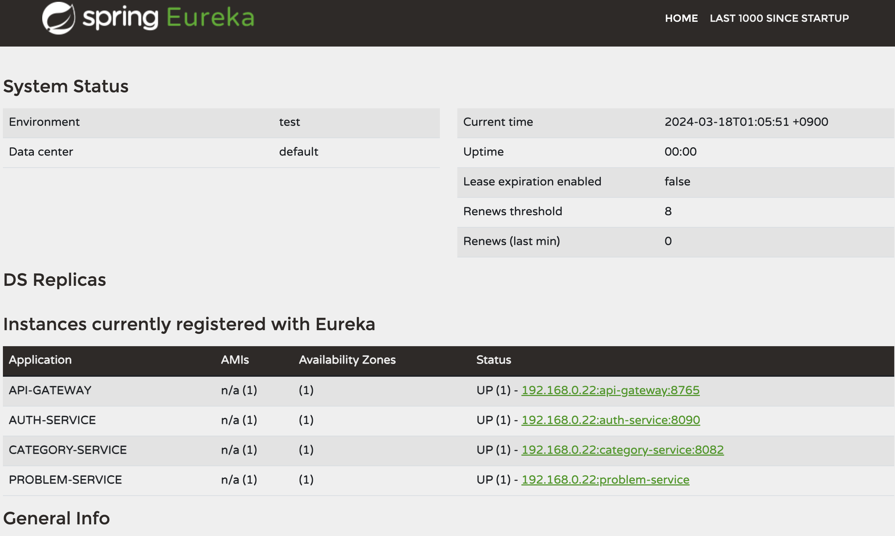
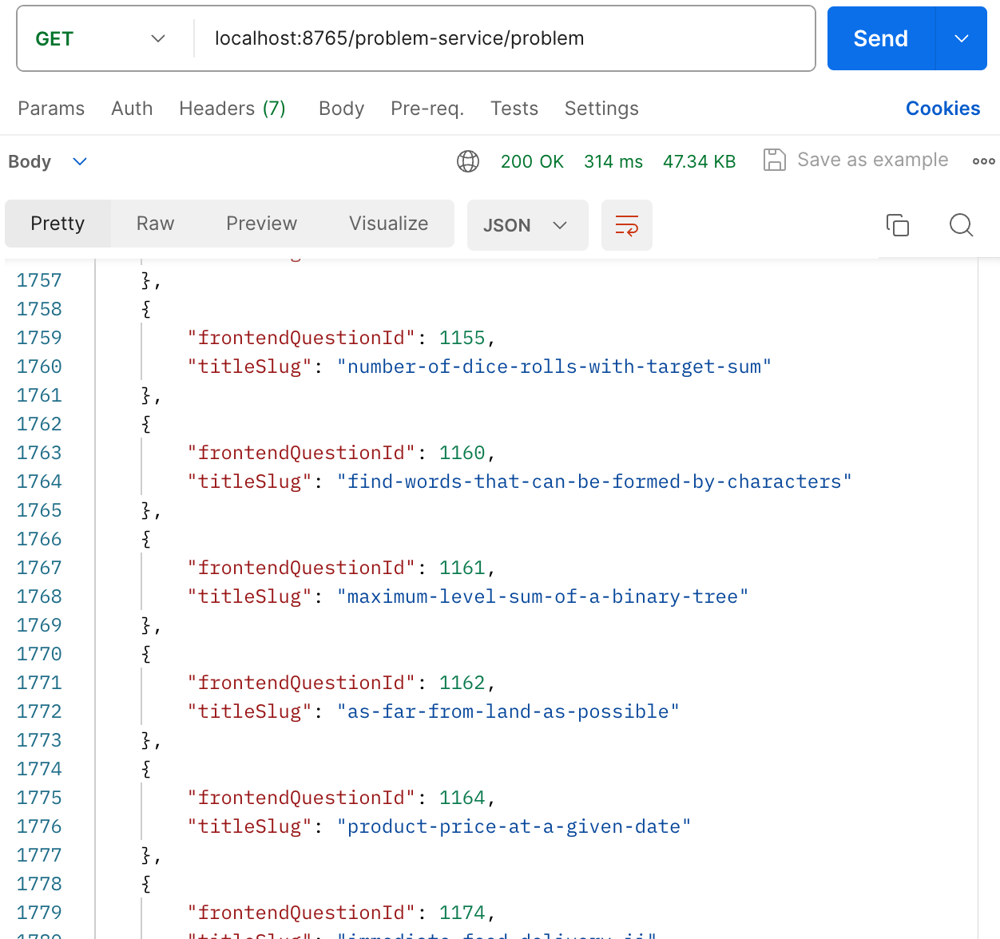
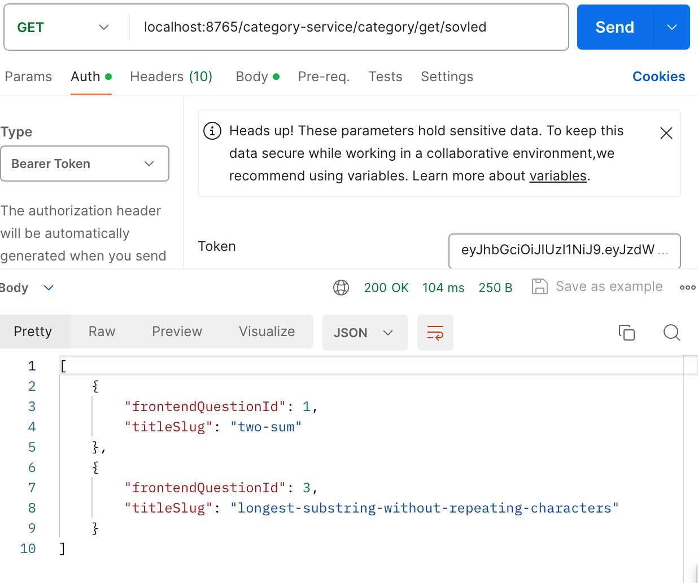
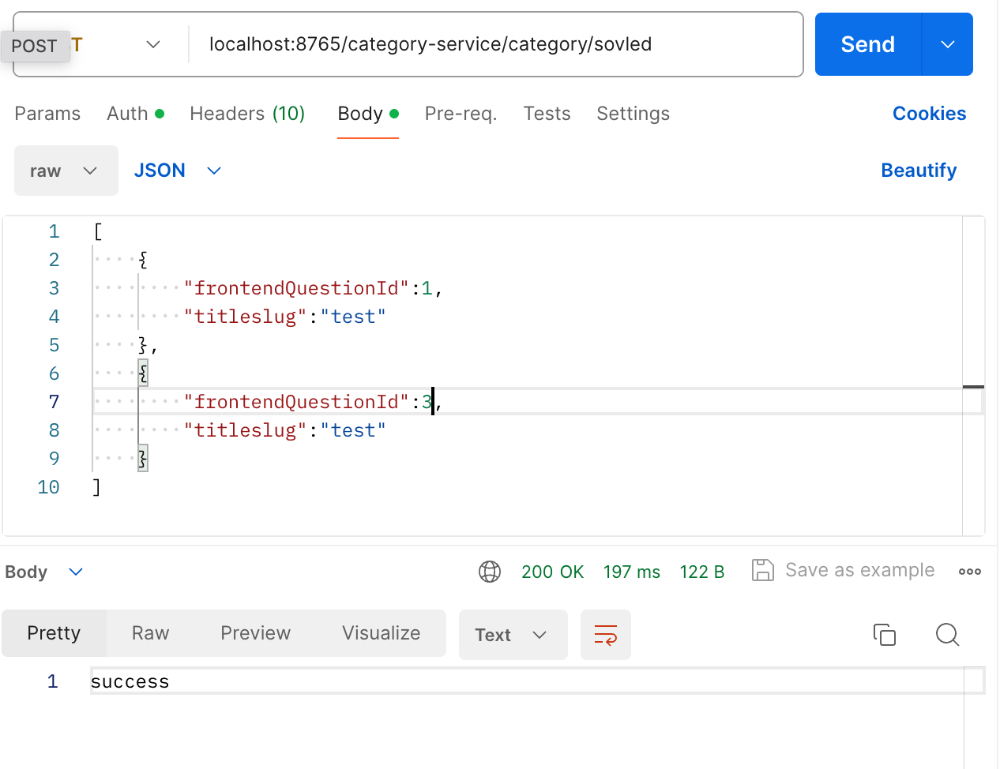
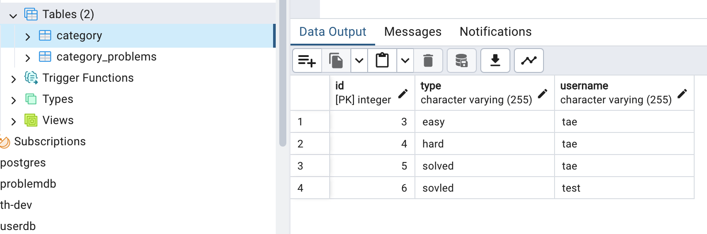
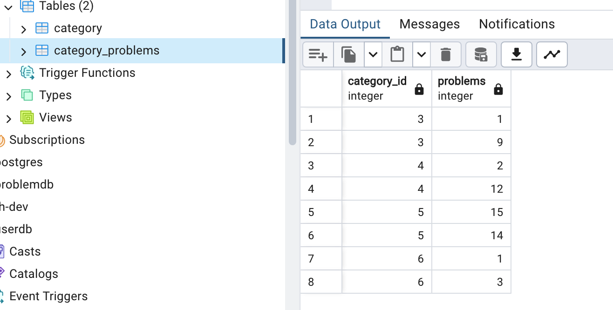
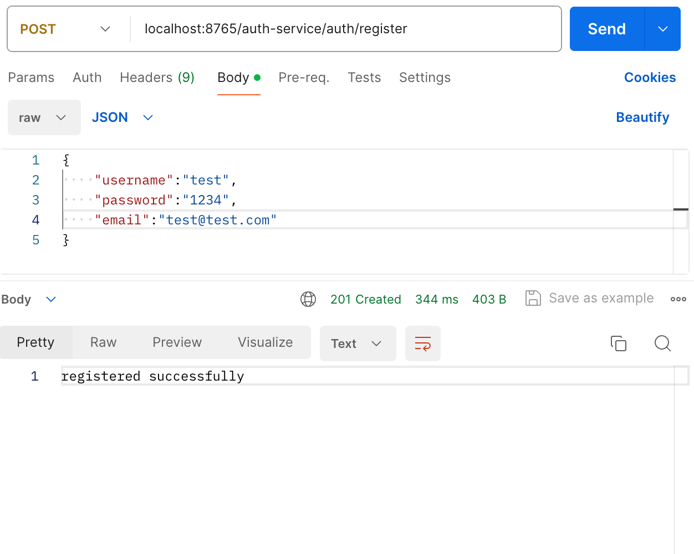
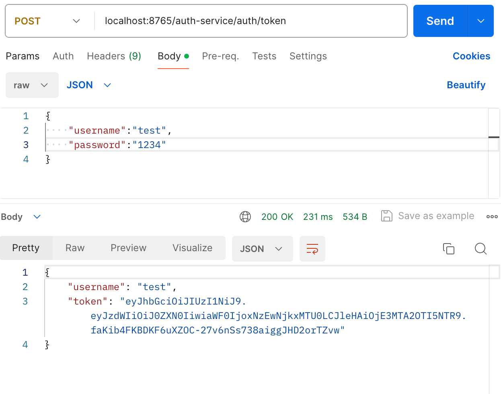
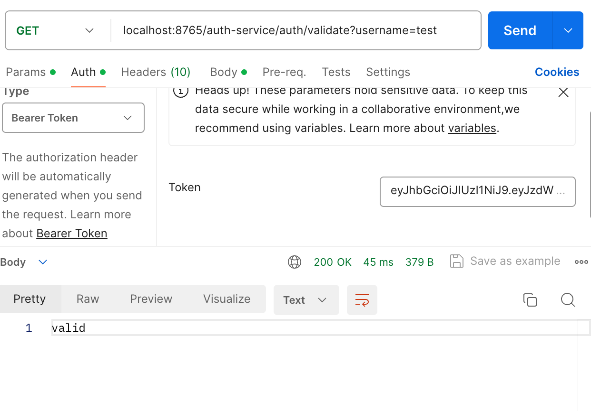

# Leeter

_!The reason why I build this application is that I want to practice to build microservices and also I need a good tool for categorizing my Leetcode-problems that I solved. "More readable, flexible and customizable service for Leetcode-problems" is the goal for Leeter. This service is not enough for that. Even if it is a lack of frontend, not fully functional as I expected, I'll improve the quality as I can._

Leeter is a web-backend-service where users can manage their Leetcode-Problems by categorizing them. The service is built using a microservices architecture by Spring-Boot. This Service consists of five services: api-gateway, service-registry, problem-service, category-service, and auth-service.

Leetcode provides the access to it's contents by using graphql.

# What's contained in each service
## api-gatway/
This service is the part of Eureka-Client. When entering the service, user can easily access other services without changing port-number.

## service-registry/
This service has the role as Eureka-Server. Eureka-Server serves several microservices.

## problem-service/
Problem-service is related to Leetcode-Problems.

- ProblemController
    - createProblem - By requesting with json-body, user can add problems which user want to create to the _problemdb_. Because Leetcode may have no such problems, the service firstly check whether user request with correct form, then if some problems exists in _problemdb_ already, that problems are automatically skipped. This method may not be called as much as once or twice a week because the resources; Leetcode's problems are limited.
    - getAllProblems - User can see all problems by sending GET-Request. These problems are just all resources in _problemdb_.
    - getProblemsByRequest - Why user need this method? User can get a list of the specific category which he/she made by this method. For example, if user has 'EASY' category and some problems are listed, the 'EASY' list of the problems can be made by sending request with bunch of problems(by json-body) and catgory-name. 
    - getProblemById - In categorydb where category-service is running, whole problems are saved as this format; _problemId_ , _catgoryName_ , _username_. So, when user want to check his/her _categoryName_ list, category-service calls problem-service for getting the problems by using corresponding _problemId_.

## category-service/
Category-service is the main service of Leeter. User can categorize their problems in his/her own way.
- CategoryController
    
    - getProblemByType - If user wants to see a specific list that he/she made, the problems can be shown just by sending GET-Request with type-name. Because of user-specific-method, category-service calls auth-service to get username correctly which is obtained by decoding JWT stored in Httpheader("Authorization").

    
    
    
    - setProblemByType - By using problem-service's getProblemsByRequest, user can create or modify category and it's problems. This also need authorization.
    
## auth-service/
Auth-service is constructed by JWT. Whenever the service needs authorization, any service can call this service. However, we just need this only in category-service. In Leeter, auth-service may be called much more than expected because main-service(category-service) needs it in every step. Therefore, this service may be updated soon. These may the solution for this problem: creating method that check whether Httpheader conatins proper token in category-service, not only in auth-service. With that approach, before entring all the services requiring authorization, api-gateway serves a role for authentication and authorization.
- AuthController
    - registerUser - User can register to Leeter by sending _AuthRequest_ which contains all information to add account to _userdb_.
    

    - generateToken - User can get JWT.
    

    - validateToken - User can check whether JWT is valid or not. This method provides repsonse containing username. Therefore, by calling this service, category-service can extract username and get validation all at once.
    
